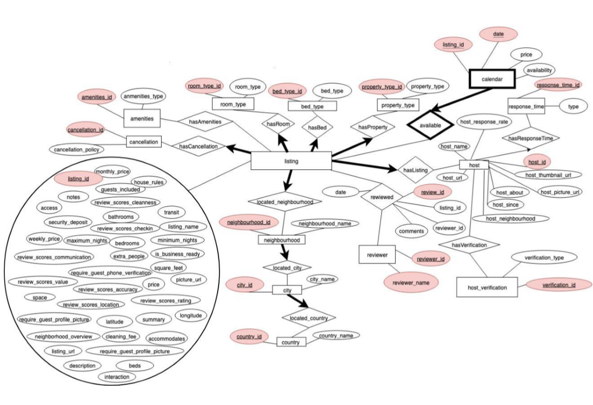

# Airbnb-Database

## Repository Structure
	.
	|-- README.md (here)
	|-- data_cleaning (notebooks for cleaning raw csv data)
	|-- src (Java code for implementing the interface)
    |-- report.pdf (final report, including DDL and query code)

## Task
Create a database for Airbnb given raw csv data. The final database should support query, add, change and update operation. 

## Description 

### Entities (EntityName: primary key):
 1. **host**: host_id 
 2. **reponse\_time**: response_time_id Response time is in fact a categorical attribute. So it can be normalized into a small entity to compress.  
 3. **host\_verification**: verification_id Host verification is in fact a categorical attribute. So it can be normalized into a small entity.  
 4. **listing**: listing_id 
 5. **neighbourhood**: neighbourhood_id Neighbourhood is in fact a categorical attribute. So it can be normalized into a small entity.  
 6. **city**: city_id City is in fact a categorical attribute. So it can be normalized into a small entity.  
 7. **country**: country_id  Country is in fact a categorical attribute. So it can be normalized into a small entity.  
 8. **cancellation**: cancellation_id Cancellation policy is in fact a categorical attribute. So it can be normalized into a small entity.  
 9. **amenities**: amenities_id Amenities is in fact a categorical attribute. So it can be normalized into a small entity.  
 10. **room\_type**: room_type_id Room type is in fact a categorical attribute. So it can be normalized into a small entity.  
 11. **bed\_type**: bed_type_id Bed type is in fact a categorical attribute. So it can be normalized into a small entity.  
 12. **property\_type**: property_type_id Property type is in fact a categorical attribute. So it can be normalized into a small entity.  
 13. **calendar**: (calendar_date, listing_id) 
 
### Relationships: 
1. **hasListing** Each house in table listing can only have one host and every house has a host to manage it.  
2. **hasReponseTime** 
3. **hasVerification** 
4. **reviewed** 
5. **located\_neighbourhood** Each house in table listing is located in one neighbourhood.  
6. **located\_city** Each neighbourhood in table neighbourhood is located in one city. 
7. **located\_country** Each city in table city is located in one country 
8. **hasCancellation** Each house in table listing has one cancellation policy.  
9. **hasAmenities**  
10. **hasRoom** Each house in table listing has one room type.  
11. **hasBed** Each house in table listing has one bed type.  
12. **hasProperty** Each house in table listing has one property type.  
13. **Available** Each record in table calendar belongs to one listing.

## ER Schema

## Contributions
Course project of Database@EPFL, finished by **Mingbo CUI**, **Annie Huang** and **Futong Liu**.